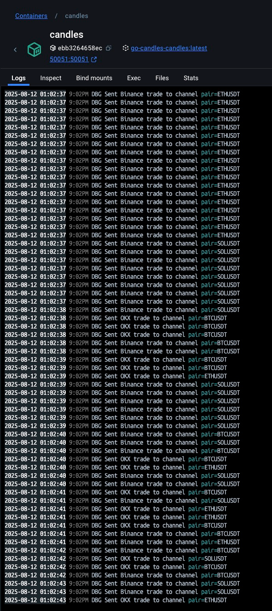
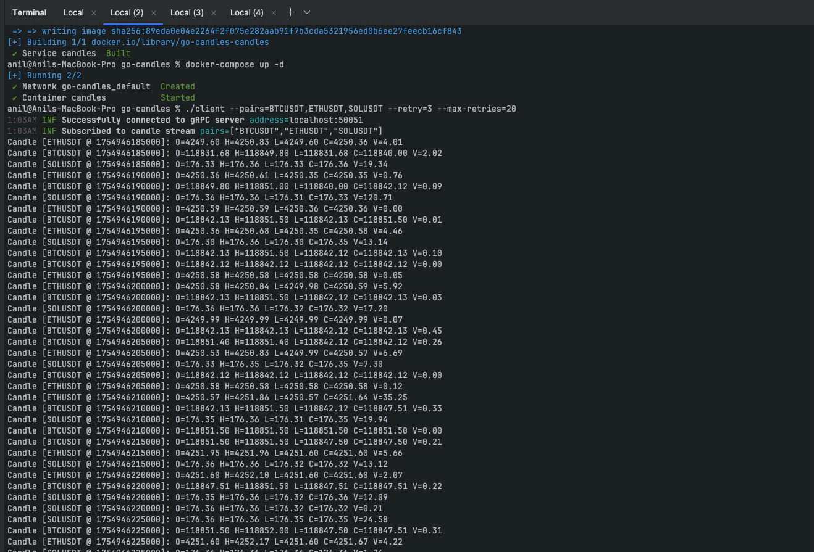

## Details of the project

### Introduction
This project is a simple exercise to subscribe to trades data of different exchanges (Binance, OKX, Coinbase) and then aggregate that data and finally creating the candles from the trade data.

### Tech Involved 
- Go-Lang
- Websockets
- GRPC connections 
- Docker

### Details 
- The project contains two main services 
    1. `candles` - That service is responsible for subscribing to trades data of different exchanges and then aggregating that data and finally creating the candles from the trade data.
    2. `client` - That service is responsible for subscribing to the candle data and then displaying that data in a web page.

### Log levels 
- The project uses different log levels to display the logs in the console.
- The log levels are `info`, `debug`, `error`, and `warn`.
- The log level can be set in the `config.yml` file or by using the `log_level` environment variable.
- The default log level is `debug` set in the `config.yml` file.
- If you want to see fewer logs, you can change the log level to `info` or `warn` in the `config.yml` file.
- This will not impact the candles printing on the console via the client service.

### How to run the project

#### Prerequisites
- Make sure you have Go 1.22 or later installed.
- Make sure you have Docker installed.

#### Running the project
1. Clone the repository:
   ```bash
    git clone git@github.com:anil-dabas/go-candles.git
    cd go-candles
    ```
2. Start the candle services using Docker Compose:
    ```bash
   docker-compose build 
   docker-compose up -d
    ```
3. If you don't have a docker installed, you can run the services locally: (Optional if No docker)
    ```bash
   cd go-candles
   go mod tidy
   make all
   go build -o candles cmd/candles/main.go 
   ./candles --config="./configs/config.yml"    
        "or"    
   ./candles            # As the default config path is set to "./configs/config.yml"
   ```
4. Run the client service:
   Make sure you are in `go-candles` folder and run:
   ```bash
    go build -o client cmd/client/main.go
   ./client --pairs=BTCUSDT,ETHUSDT,SOLUSDT --retry=3 --max-retries=20
   ```
   
### Demo logs snapshots 

1. Candle Service Logs from docker



2. Client Service Logs from local




